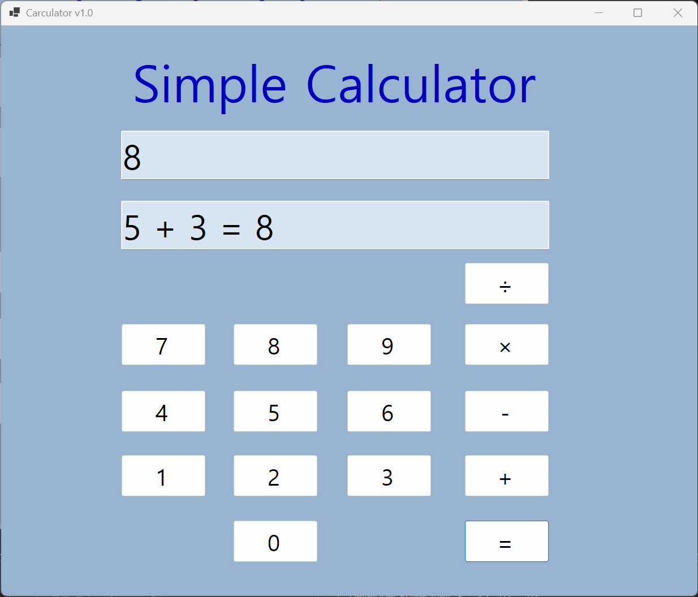
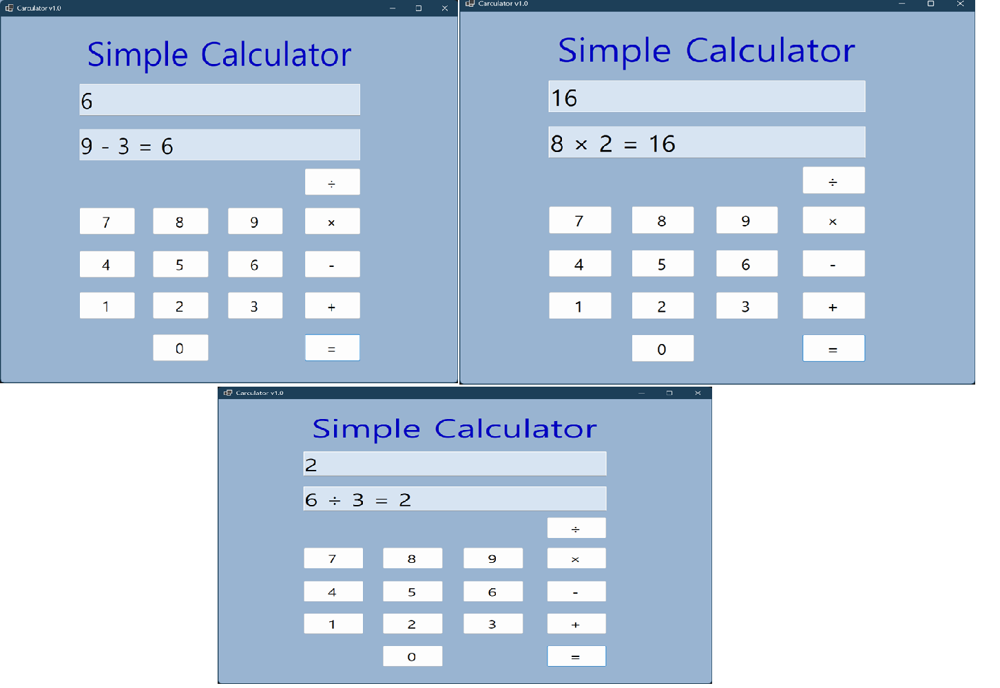

## 실행 화면 (과제1)

**과제 내용**
- TextBox(입력표시, 결과표시), Button(계산) 등을 적절히 배치합니다.
- 숫자 Button 클릭 시 TextBox에 표시합니다. 2가지 방법으로 표시.
- 사칙연산 계산 기능: 더하기 기능 구현.
- 계산 결과 출력: 결과 값을 문자열로 변환하여 표시.

**구현 내용과 기능 설명**
숫자 버튼을 누르면 아래 텍스트박스에 숫자가 입력됩니다.
더하기 버튼을 누르면 위 텍스트박스에 피연산자와 연산자가 기록되며, 다시 숫자를 입력하고 '=' 버튼을 누르면 연산이 수행되어 텍스트박스에 최종 결과가 표시됩니다.

## 실행 화면 (과제2)

**과제 내용**
- 뺄셈(-), 곱셈(*), 나눗셈(/) 버튼 추가
- 각 버튼 클릭 시 연산자만 변경하여 동일 로직 적용

**구현 내용과 기능 설명**
사칙연산 버튼을 모두 활성화하였습니다. 각 연산자 버튼의 클릭 이벤트를 하나의 공통 이벤트 핸들러로 묶어 코드를 간결하게 만들었습니다. 계산 로직은 `PerformOperation`이라는 별도 메서드로 분리한 뒤 `switch` 조건문을 활용해 알맞은 산술 연산을 처리하도록 구현했습니다. 특히 나누기의 경우 0으로 나눌 때 프로그램에 오류가 발생하지 않도록 예외 처리를 추가하여 안정성을 높였습니다.

